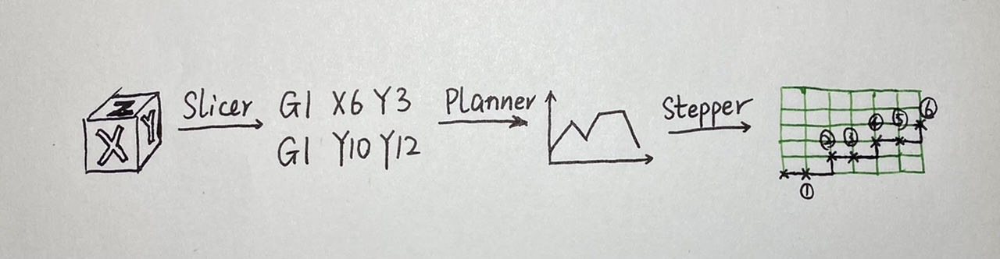
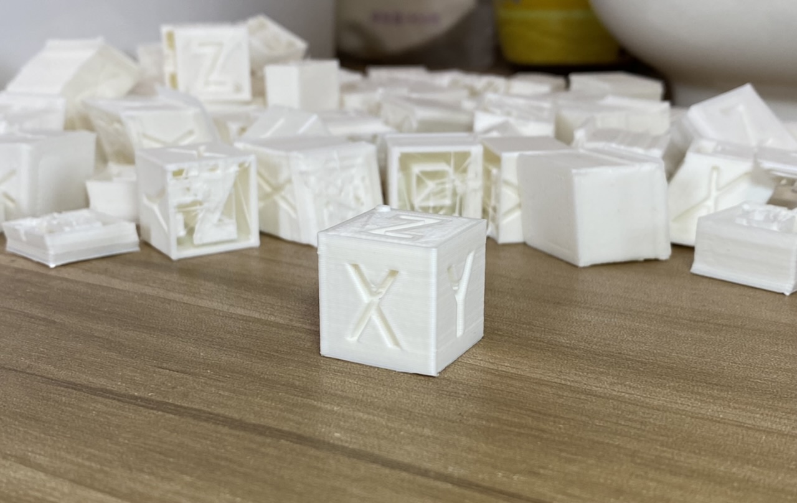
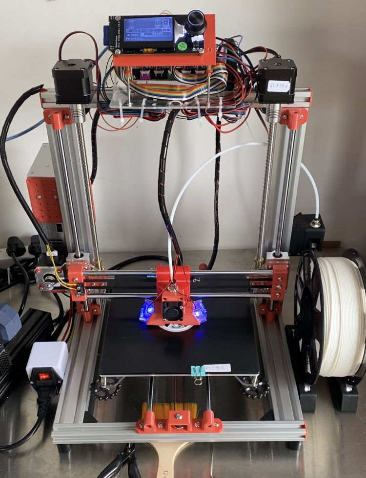
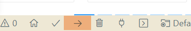
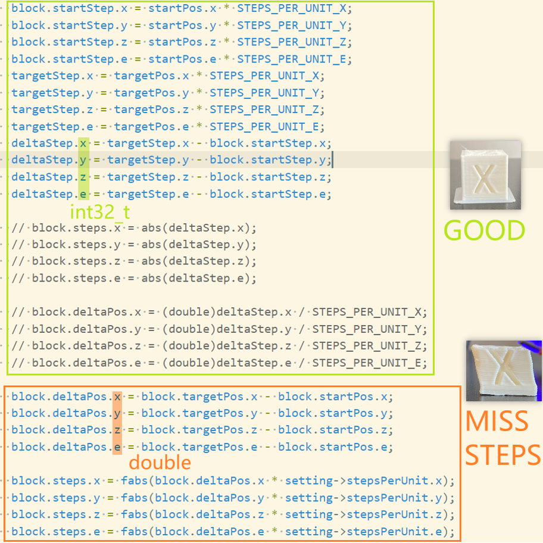
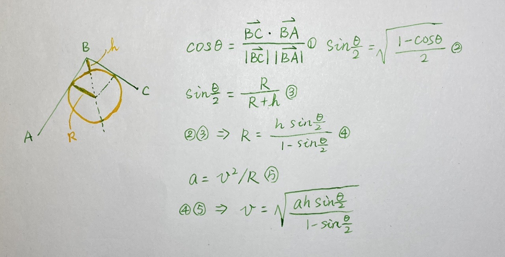

## How 3d printer works?

​	Hello, I am Arno. Today we are going to find out how 3d printer works by writing a firmware. [code link](https://github.com/arnosolo/simple_3d_printer) 



Read in other languages: [简体中文](./docs/cn/浅析3d打印机原理.md) 


#### Develop platform

##### Hardware

- MCU

  - [AVR mega2560](https://ww1.microchip.com/downloads/en/devicedoc/atmel-2549-8-bit-avr-microcontroller-atmega640-1280-1281-2560-2561_datasheet.pdf) 

- Mother board

  - [MKS GENL V2.1](https://github.com/makerbase-mks/MKS-GEN_L/tree/master/hardware/MKS%20Gen_L%20V2.1_001) 

- Stepper driver

  - X TMC2008
  - Y TMC2008
  - Z A4988
  - E TMC2225

- Mechanical structure

  - Big fish i3

    

##### Software

1. Download [vscode](https://code.visualstudio.com/)

2. Install addon platformio

3. Open platformio tag, create new project, choose Board as mega2560, choose Framework as Arduino.

4. Now we write some test code in `src/main.cpp`

   ```cpp
   // src/main.cpp
   #include <Arduino.h>
   
   void setup() {
       Serial.begin(115200);
   }
   
   void loop() {
       Serial.println("Hello from Mega2560.");
       delay(1000);
   }
   ```

5. Connect 3D printing motherboard with compute, click the ➡ button at the bottom of `vscode`. Then `platformio` will compile and upload the test code above into 3D printing motherboard

   

6. Open any Serial assistant you prefer, connect the motherboard, if you found `Hello from Mega2560.` is printed, then you are all set.


#### Parse gcode

In this section, we should implement the `parse` function of `Gcode` class which is able to convert a gcode string like `G1 X2.4 Y5.6` into a `gcode object`.

- Most used gcode

  ```
  G1 F200 X2 Y4 ; move to (2,4,0) and set feedrate as 200mm/min
  G28 X0 Y0 ; move X/Y to min endstops
  M104 S200 ; set hotend temp as 200℃
  ```

- `gcode object` example

  ```cpp
  gcode.cmdtype = 'G';
  gcode.cmdnum = 1;
  gcode.X = 2.4;
  gcode.Y = 5.6;
  gcode.hasX = true;
  gcode.hasY = true;
  ```

  Notice that if you try to use '\n' to split string like me, you need be careful that some gcode string might end with "\r\n"


#### SD card

In general, we need to configure SPI to use SD card. But we are using mega2560, we can use the [SD Library for Arduino](https://github.com/arduino-libraries/SD). The only thing we need to do is find which pin is the `CS` (chip select) pin in schematic and call `SD.begin(csPin)` function in `setup` function.


#### Temperature control

Call `hotend.update()` every 150ms, which will decide turn the heater on or off according to current temperature.

- 150ms interval was implemented using timer(`Heater::init`)
- Temperature control algorithm is PID(`Heater::calculatePid`)


#### Motor control

In this section, we should figure out how to control stepper motor through a stepper motor driver like `A4988`.


##### A4988


1. VMOT

   8V~35V DC, A 100uf capacitor needs to be placed between `VMOT` and `GND` to quickly respond to the motor's power demand. Beware, this is the only pin that connect high voltage, if you connect other pins with 24V DC, this module will **burn in seconds**.

2. 1A 1B

   Connect to coil 1 of the stepper motor

3. 2A 2B

   Connect to coil 2 of the stepper motor

4. VDD

   MCU power

5. DIR

   Connect to MCU, high and low each represent a different direction.

6. STEP

   Each time this pin receives a pulse, `A4988` will dive the stepper motor advance one step. Normal stepper motor used in 3d printer takes 200 steps to complete a revolution, which means 200 pulses.

7. MS1 MS2 MS3

   But in most conditions, to drive stepper motor advance one revolution, 3200 pulses should be feed into A4988. That's because one step is divided into 16 micro steps.

   | MS1  | MS2  | MS3  | subdivision |
   | ---- | ---- | ---- | ----------- |
   | 0    | 0    | 0    | 1           |
   | 1    | 0    | 0    | 2           |
   | 0    | 1    | 0    | 4           |
   | 1    | 1    | 0    | 8           |
   | 1    | 1    | 1    | 16          |

8. ENABLE

   LOW:  enable module

   HIGH: disable module

9. SLEEP

   LOW:  sleep

   HIGH: active

10. RESET

    LOW:  reset module


##### Steps per unit

Now we know how to control stepper motor through `A4988`. But how long does the hotend travel(mm) if motor advance one step?

- Synchronized pulleys and belts

  Take the 2GT 20-tooth synchronous wheel as an example. 2GT means that one tooth corresponds 2mm, then if the synchronous wheel has 20 teeth, each time it rotates 1 revolution, the belt will travels 40mm. And if we motor drive as 16 subdivision, then one revolution means 3200 pulses is needed. 

  ```
  stepPerUnit = 3200steps / 40mm
  ```

- Screw

  Take a screw with a pitch of 2mm and a lead of 8mm as an example. The lead means the linear distance traveled by the screw for one revolution.

  ```
  stepPerUnit = 3200steps / 8mm
  ```


#### Endstop


`Endstop` has 3 pins: normal open(`NO`), normal close(`NC`), circuit common(`COM`). If we the `NC` and `COM` then:

| State         | on or off | MCU read |
| ------------- | --------- | -------- |
| not triggered | on        | LOW      |
| triggered     | break     | HIGH     |


#### Motion control

##### How to advance

Assuming that our starting point is (0,0), target point is (6, 3). Then `motorX` shoud advance (6 x 80) steps, `motorY` should advance (3 x 80) steps. Of course, we can demand the `motorX` to advance first then `motorY` like Plan B. But there is a better way like Plan A.


This is *Bresenham's algorithm.* Specifically, since it takes 480 steps in the X direction and 240 steps in the Y direction, hotend should move 480 times, each time `motorX` advance one step, however `motorY` advance one step each tow times. Each time of motion is called a `step event`. The total number of times is called `step event count`, and its value is the greater of X and Y.

```cpp
// module/Planner.cpp - planBufferLine
block.stepEventCount = getMax(block.steps);

// main.cpp - motion control isr
motorX.deltaError = -(curBlock->stepEventCount / 2);
motorY.deltaError = motorX.deltaError;

motorX.deltaError += curBlock->steps.x;
if (motorX.deltaError > 0) {
    motorX.moveOneStep();
    motorX.deltaError -= curBlock->stepEventCount;
}

motorY.deltaError += curBlock->steps.y;
if (motorY.deltaError > 0) {
    motorY.moveOneStep();
    motorY.posInSteps += curBlock->dir.y;
    motorY.deltaError -= curBlock->stepEventCount;
}
```

Do not use **float** to calculate the number of steps directly, because it might lead to step missing.




##### Multiple motion commands

We should push a `block` which contains how many steps every motor should advance in a `queue`, and take it out when needed.

- `block`

  ```cpp
  typedef struct {
    volatile bool isBusy;
    volatile bool isReady;
    volatile bool isDone;
    bool needRecalculate;
    uint32_t id;
  
    double distance; // mm
    double stepsPerMm; // steps/mm
    int8_xyze_t dir; // -1 or 1
    int32_xyze_t startStep; // mm
    uint32_xyze_t steps; // steps
    uint32_t stepEventCount; // steps
    uint32_t stepEventCompleted; // steps
    uint32_t accelerateUntil;
    uint32_t decelerateAfter;
    
    double entrySpeed; // mm/s
    double exitSpeed; // mm/s
    double nominalSpeed; // mm/s
    uint32_t entryRate; // steps/s
    uint32_t exitRate; // steps/s
    uint32_t nominalRate; // steps/s
    uint32_t speedRate; // steps/s
  
    double acceleration; // steps/sec^2
    uint32_t accelerateRate; // steps/sec^2
  } block_t;
  ```

  

#### Speed control

For example, if we want set speed as 1000steps/s, then every `step event` takes 1ms, which means every 1ms an interrupt should be generated.


##### Trapezoidal acceleration

We can set speed as constant, but changing the speed can improve efficiency.

Specifically, a block can be divided into an acceleration segment, a constant speed segment and a deceleration segment.  Noted that if the length of block is very short, the acceleration graph should becomes a triangle.


##### Connection speed

In order to prevent the speed and coherence between each block. We need to calculate the entry speed and exit speed of each block. The estimation method is given below. Noted that the arc in the figure is only used to estimate the connection speed. The hotend does not go through this arc in practice.




