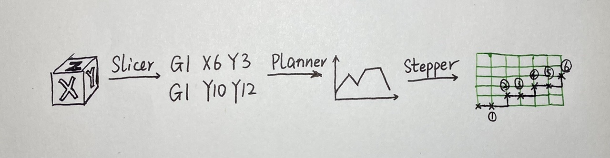

## 浅析3D打印机原理

本文将通过实现一个3D打印机固件来解释3D打印机是如何工作的. 点击文章索引可快速跳转. [代码地址](https://github.com/arnosolo/simple_3d_printer)


#### 起因

​	大家好, 我是阿诺. 去年我网购了一台3D打印机, 配置很简单, 30min就可以开始打印了. 从此我有了一个新爱好就是蹲在打印机前看着零件就这样被一针一针地被编织出来, 一边瞅着一边想着仅靠四个电机机械的正转反转, 怎么就能打印出各种各样复杂的三维模型?

​	于是我开始好奇起这到底是怎么实现的, 但是我毫无头绪也不相信自己能够搞明白. 首先是, 你说我要是把这机器拆了, 我还能把它装回去吗? 万一装不回去, 那可真是投告无门啊. 就算到时候厂家愿意协助, 人家那厂在几千公里外, 又不是说隔壁小区, 想帮也很难. 其次是, 软件部分我也不知道该如何实现, 虽然我使用的Marlin固件代码是开源的, 但是它的源码有百来个文件, 随便打开一个文件一看几千行代码, 而且其中还穿插了各种条件编译, 完全不知道该从何看起啊.

​	时间就这样过去了几个月, 有一天我突然看到了关于如何DIY一台3D打印机的视频. 我打开一看发现这视频讲的还挺详细的嘛, 下载了链接的资料, 好家伙, 不仅有装配图, 还有BOM表, BOM表上甚至还附上了每个零件的购买链接以及参考价格防止奸商随意涨价. 瞬间感觉这个事情可行啊, 于是产生了DIY一台3D打印机的想法. 说干就干, 下单了一堆零件等了好久终于到了, 却发现买了螺丝当没有合适的螺丝刀, 于是再下单并等待螺丝刀送达. 买了主板却发现连线还需要胶壳端子和压线钳, 这一等又是好几天. 于是整整两个星期后我才组装好了我的第一台DIY打印机, 型号是[大鱼i3](https://space.bilibili.com/488684813/channel/collectiondetail?sid=19843), 设计者是[大鱼](https://space.bilibili.com/488684813).

​	组装调试好机器后, 我有了两台可用3D打印机. 相较之前花了2000多买的机器, 我实际上更喜欢这台DIY的. 因为虽然DIY的这台排线有点乱, 费时又费力, 但是它要是坏了我完全知道该怎么修, 而且打印精度与前者不分伯仲. 当然我并不是说之前买的机器(`Anycubic Vyper`)不好. 事实上恰恰相反, 我觉得`Anycubic Vyper`不仅性能优秀而且样子也好看. 事实上, [大鱼](https://space.bilibili.com/488684813)推出了3种结构的打印, 分别时`i3` `corexy` 和 `um`. 我之所以选择i3结构的, 很大程度上也是因为我已经有一台不错的打印机了, 它的结构就是i3, 所以我可以那它来做基准. 是的, `Anycubic Vyper`定义了我心目中一台完善且精致的打印机打印机是什么样子的--30min就可以开始打印,同时还有个好看的外观已经友好的用户界面, 使得3D打印机不再是专业人士的专业工具, 而可以是普通人家中的一台家电. 当然了, 我的目标是理解3D打印机是如何工作的, 那么这些完善且精致的工具就只能被当成是参考资料. 

​	现在我对3D打印机的机械结构有了基本认识. 更重要的是开始相信自己也许也有可能搞清3D打印机的原理了. 于是我决定开始尝试自行编写一个3D打印机固件. 这个部分犹如3D打印机的灵魂, 自然也更加难以理解. 好在在长达半个月每天天亮就开始盯着屏幕试图发现自己的代码哪里出来问题, 结果到了上床睡觉前只能在绝望中睡下的日子之后, 最终还是打印出了和普通一样好的测试模型. 也才有了这篇文章, 毕竟要是都打印不出实际的正常的模型, 那我什么资格写这样的文章呢.

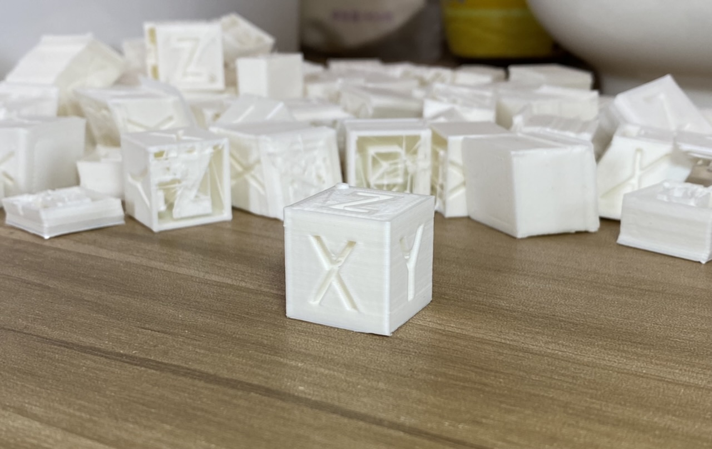


#### 开发环境

* 开发框架

  * Arduino

* 主控芯片

  * [AVR mega2560](https://ww1.microchip.com/downloads/en/devicedoc/atmel-2549-8-bit-avr-microcontroller-atmega640-1280-1281-2560-2561_datasheet.pdf)

* 主板

  * [MKS GENL V2.1](https://github.com/makerbase-mks/MKS-GEN_L/tree/master/hardware/MKS%20Gen_L%20V2.1_001) 

* 电机驱动

  * X TMC2008
  * Y TMC2008
  * Z A4988
  * E TMC2225

* 显示器

  * 暂未实现, 通过串口交互

* 机身

  * [大鱼i3](https://space.bilibili.com/488684813/channel/collectiondetail?sid=19843) 

    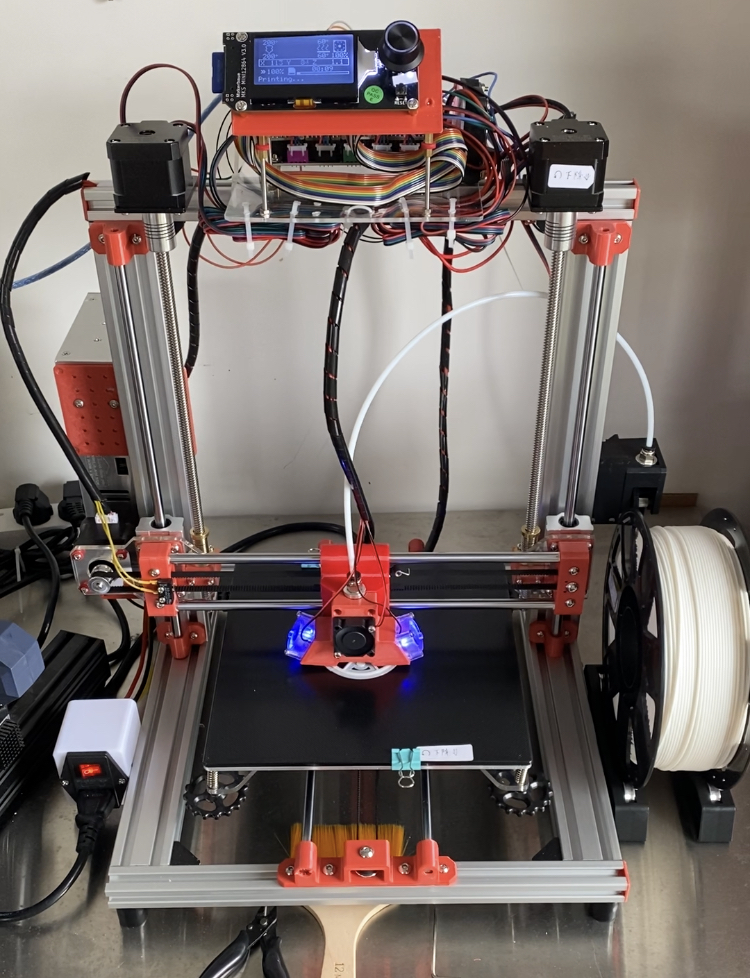


#### G代码解析

这一节的目标是实现`Gcode::parse`方法, 将串口输入的 *G1 X2.4 Y5.6* 转换`gcode对象`

```c++
gcode.cmdtype = 'G';
gcode.cmdnum = 1;
gcode.x = 2.4;
gcode.y = 5.6;
```

G代码格式我参考的是[marlin](https://marlinfw.org/docs/gcode/G000-G001.html). 这部分比较简单, 就略过了, 具体的实现可以看`gcode/gcode.cpp`. 完成即可进入下一节.


#### 温度控制

这一节的目标是串口输入 *M104 S100* 热端开始加热, 达到100℃后维持在100℃.

温度控制使用PID控制器, 具体来说就是要创建一个`hotend`对象,它将拥有一下几个功能:

- `hotend.setTargetTemp(200)` 设定目标温度为200℃
- `hotend.readTemp()` 读取当前温度
- `hotend.update()`   以更新MOS管的开关时间

而后创建一个每200ms执行一次的中断服务函数, 每次中断执行一次`hotend.update()`. (定时器初始化放在`Heater::init`中)

其中Heater类的实现在`module/Heater.cpp`, 中断服务函数在`main.cpp`

这里主要需要讲的是PID控制器几个参数的含义(虽然它们名字听上去很复杂,但是其实只是简单的加减乘除):

- 控制器输出值

  - 一个0~255的数, 125表示加热器功率设为50%

- **E**rror

  - 当前温度150℃, 目标温度200℃, 则偏差值为50

- **P**roportion 比例

  ```cpp
  p = kp * err;
  ```

  - 假设当前温度150℃, 目标温度200℃, `kp`值为1.0, 则`p项`=50. 加热器功率设为(50/255)=20%
  - 有了这一项就能控制温度. 但是只有这一项, 可能加到170℃温度就加不上去了, 因为这时候加热器功率只有12%, 正好加热器向空气中散发的热量也是这个功率. 这种现象被称为*稳态误差*.

- **I**ntegration 积分

  ```cpp
  pidIntegral += err;
  i = ki * pidIntegral;
  ```

  * `i项`可以解决只有`p项`时出现的*稳态误差*. 假设`ki`为0.5, 那么当加到170℃温度就加不上去时, `pidIntegral`每200ms就会增加30, `i项`每200ms就会增加15, 加热器功率每200ms就会增加(15/255)=6%, 如此假以时日, 温度自然就上去了.

- **D**ifferentiation 微分

  ```cpp
  d = kd * (err - pidPrevErr);
  ```

  * 你可能会说, 按我这个说法, 那只要有`p项`和`i项`就能实现温度控制了. 确实如此, 如果你发现有了`p项`和`i项`就能很好的控制温度的话, 那完全可以把`ki`设成0. 但是如果我们想要防止温度变化过快的话, 那么可以试试加上`d项`. 因为假设目标温度为200℃, `kd`为1. 如果上一个周期温度为170℃, 这一个周期温度为190℃, 那么`d项`就是20. 而如果上一个周期温度为170℃, 这一个周期温度还是170℃, 那么`d项`就是0. 可以说`d项`这家伙就是**讨厌变化**. 这在到达目标温度后, 防止温度快速滑落很有用, 因为上文不是提到了嘛, `i项`需要"假以时日", `p项`则在快到目标温度时萎靡不振.


#### 电机控制

这一节的目标是实现步进电机的正反转, 实现*G28*归零指令

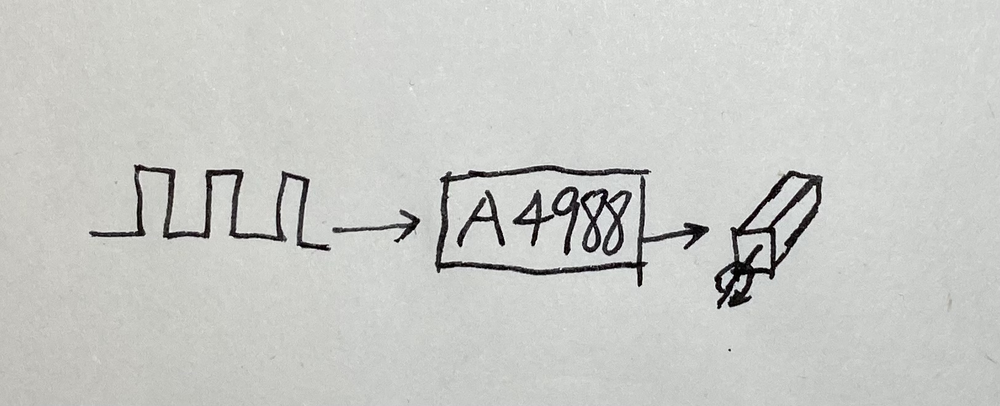

##### A4988

我们将使用`A4988`模块来控制步进电机, 下面给出`A4988`的原理图

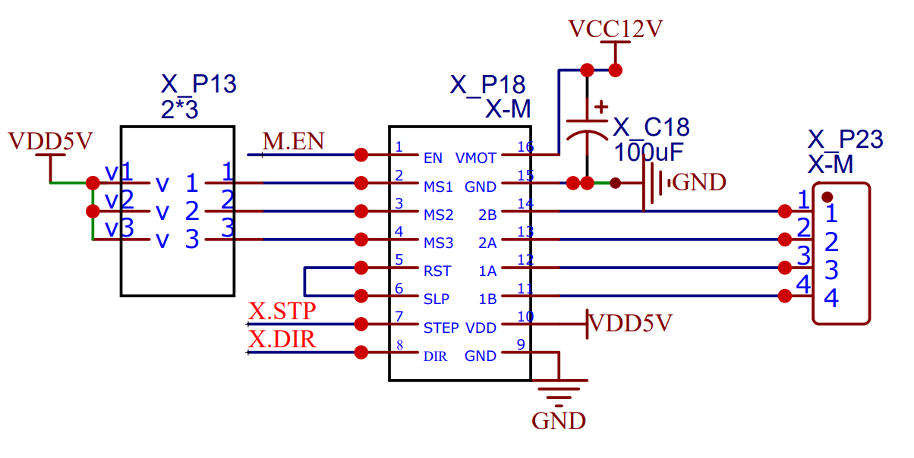

1. VMOT

   接8v~35v直流电源,需要在`VMOT`和`GND`间布置一个100uf的电容,以快速响应电机的电能需求.

2. 1A 1B

   接第一个线圈

3. 2A 2B

   接第二个线圈

4. VDD

   接MCU电源

5. DIR

   方向控制引脚,接MCU输出,高低电平分别代表一个转动方向

6. STEP

   一个方波电机运动一次,如果设置步进细分为1,则运动一次一步进,一次步进为1.8°,200步可以转一圈

7. MS1 MS2 MS3

   对步进进行细分,至多可以将一步进细分为16次运动

   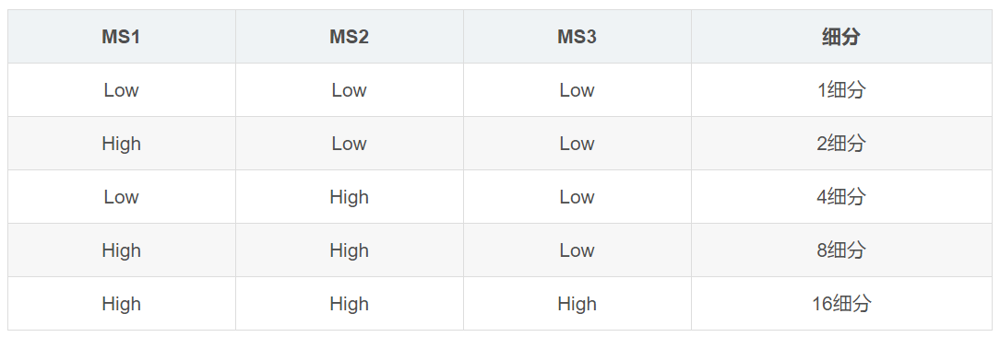

8. ENABLE

   接`低电平`模块开始`工作`, 接`高电平`则模块`关机`, `悬空`则模块`工作`.

9. SLEEP

   接低电平则电机断电,用手拧可以自由转动. 接高电平则电机工作.

10. RESET

    默认悬空. 收到低电平时,重置模块. 如果不打算控制这个引脚,则应该将其连接到SLEEP引脚以设置为高电平.


所以使用`A4988`控制电机一共有4步, 具体实现在`module/Stepper.cpp`

1. 接线. 前往注意**不要装反了**,装反了模块会**烧掉**.
2. 设置`enable`引脚为`低电平`以激活模块
3. 设置`dir`引脚以设置方向
4. 向`step`引脚发射脉冲以要求电机运动


##### 轴步数

现在我们知道了如何经由`A4988`控制电机, 但是电机转一步(step), 打印头到底走多少距离(mm)呢?

- 同步轮与皮带

  以2GT, 20齿的同步轮为例. 2GT的意思是走一个齿皮带运动2mm, 那么如果同步轮有20齿, 转一圈皮带走40mm. 而如果我们电机驱动采用16细分, 那么步进电机一圈就是3200步.

  ```
  轴步数 = 3200steps / 40mm = 80steps/mm
  ```

  所以如果我们使用i3的结构, 希望打印头在x轴正方向上前进10mm, 那么就需要MCU向`A4988`发射 3200 * 10 = 32000 个脉冲.

- 丝杆

  以螺距2mm, 导程8mm的丝杆为例. 导程的意思是丝杆转一圈所行走的直线距离. 所以

  ```
  轴步数 = 3200steps / 8mm = 400steps/mm
  ```

  所以如果我们使用i3的结构, 希望打印头在z轴正方向上前进10mm, 那么就需要MCU向`A4988`发射 3200 * 400 = 1,280,000 个脉冲


##### G28归零

想要归零的话, 除了需要了解如何驱动电机外, 还需要了解限位开关的原理

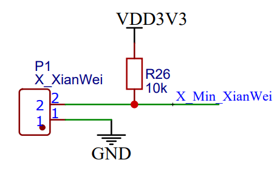

限位开关有三个引脚分别是常开,常闭,公共端. 相应的就有了两种工作模式`常开`和`常闭`. 这里我们选择`常闭`. 于是通过读取MCU引脚电平高低即可实现判断, 具体实现在`module/Endstop.cpp`

| 限位开关状态 | 电路通断 | MCU引脚电平 |
| ------------ | -------- | ----------- |
| 未触发       | 通       | 低          |
| 触发         | 断       | 高          |


#### 路径规划与执行

这一节的目标是串口输入 *G1 F1000 X6 Y3* 热端将到达指定坐标点.

##### 前进方法

假设我们的起始点为(0,0) 那么走到(6, 3)就需要要求 X电机走(6 x 80)步, Y电机走(3 x 80)步. 我们当然可以要求X电机先走, Y电机后走, 也能到达目的地, 但是画出来的线与理想的线段可就有相当的差距了. 或者我们可以先画出理想线段, 然后在它的附近画线.

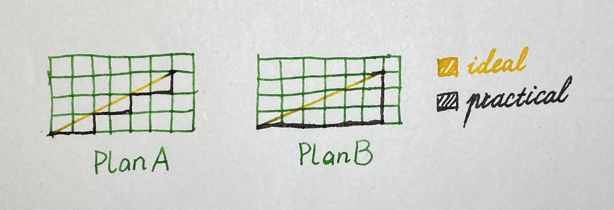

可是这该怎么实现呢? 这个问题前人已经想好了, 还给它起了个名字叫*Bresenham算法*. 具体来说就是既然X方向需要走480步, Y方向需要走240步, 那么就相当于总共要走480次, X方向每次前进一步, Y方向每2次前进一步. 这480次运动事件, 每一次被称为一个`step event`. 总的次数叫做`step event count`, 它的值就是X,Y中的较大值.

```cpp
// module/Planner.cpp - planBufferLine
block.stepEventCount = getMax(block.steps);

// main.cpp - motion control isr
motorX.deltaError = -(curBlock->stepEventCount / 2);
motorY.deltaError = motorX.deltaError;

motorX.deltaError += curBlock->steps.x;
if (motorX.deltaError > 0) {
    motorX.moveOneStep();
    motorX.deltaError -= curBlock->stepEventCount;
}

motorY.deltaError += curBlock->steps.y;
if (motorY.deltaError > 0) {
    motorY.moveOneStep();
    motorY.posInSteps += curBlock->dir.y;
    motorY.deltaError -= curBlock->stepEventCount;
}
```

注意实现:

​	不要使用**浮点数**来计算步数, 因为会导致失步

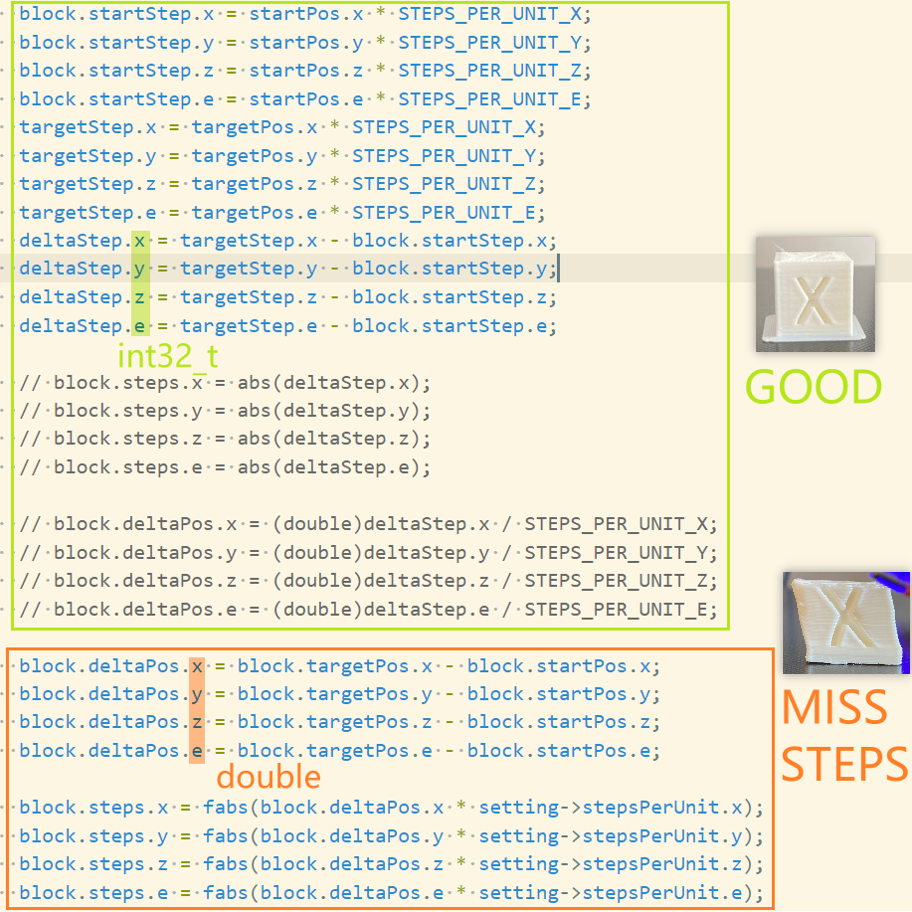


##### 速度控制

使用定时器中断的时间来控制打印头前进的速度. 

比如我们希望速度是1000steps/s, 那么定时器就需要每1ms产生一次, 同时在中断服务函数中执行一次`步进事件`(step event).

如果我们需要改变速度, 则可以在中断服务函数中设定触发中断的计数器值. 不过我们现在可以暂时把它设置成匀速.


##### 多个运动指令

上文我们实现了如何执行一条G1指令. 那么多条指令该怎么办呢?

我们可以将一个包含了每个电机运动多少步, 向那个方向运动的对象放入一个`队列`(queue)中. 需要的时候再从队列中取出.


#### 速度衔接

这一节的目标是计算两运动线段的衔接速度, 而后计算出每个运动线段何时加速何时减速.

其实做好上面的步骤, 把移动速度设置成匀速, 打印机就能用了. 但是我们还是能够通过适当的改变移动速度来使得打印机的打印速度有适当的提高.

##### 梯形加速

上文提到我们可以通过改变中断时间来改变速度. 那么就会涉及到一个问题: 何时加速, 何时减速?

具体来说就是将一个block分成加速段,匀速段以及减速段并计算它们的长度. 计算并不复杂, 已在下图给出, 需要注意的是如果当前block长度很短的话, 加速图形会由梯形变成三角形.

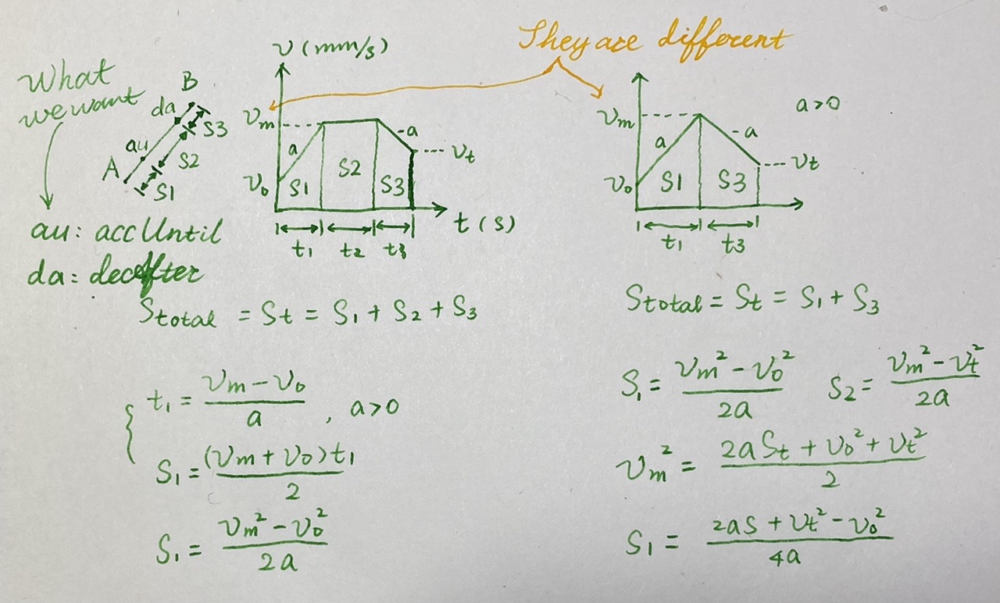


##### 衔接速度

为了不让每个block之间速度跟连贯. 我们需要计算每个block的进入速度和退出速度. 估算方法下文已给出, 需要注意的是图中的圆弧只是用来估算衔接速度的, 打印头实际的路径并不会经过这段圆弧.

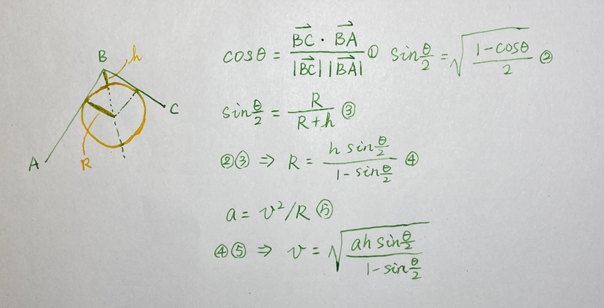


#### 后记
  我以前是不喜欢旅行的, 因为在我看来那不过是换个背景拍照. 我现在喜欢了, 因为我对旅行的定义变了, 我现在把它定义成对一个事物的深入探索, 而了解3D打印机是如何工作的就是其一.