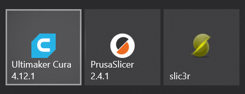
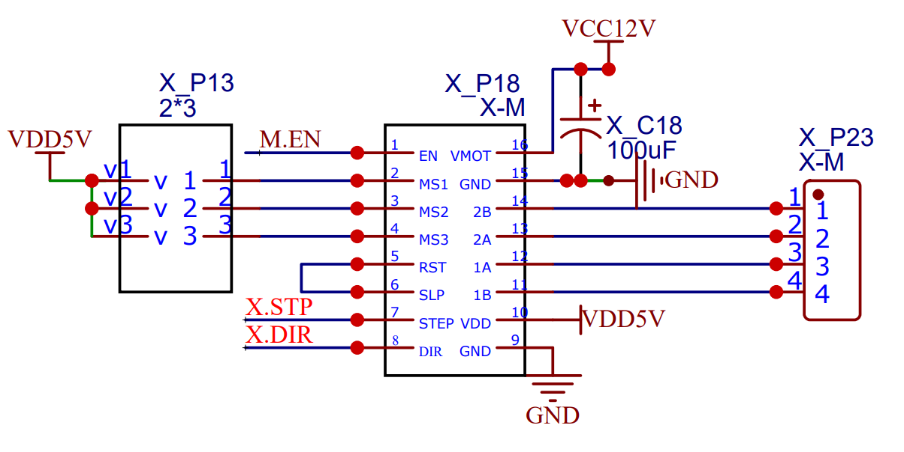
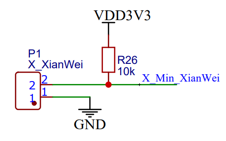
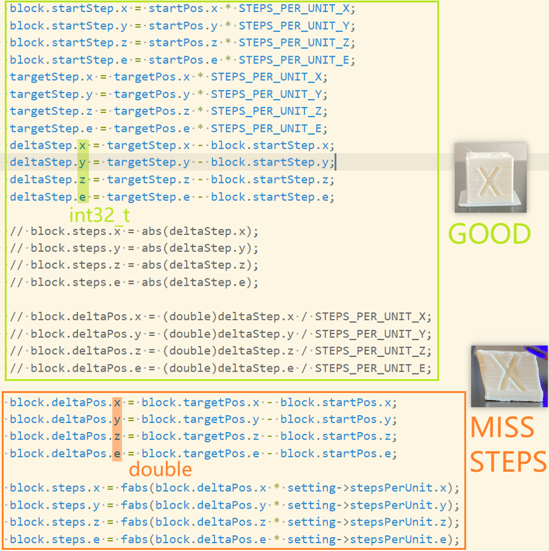
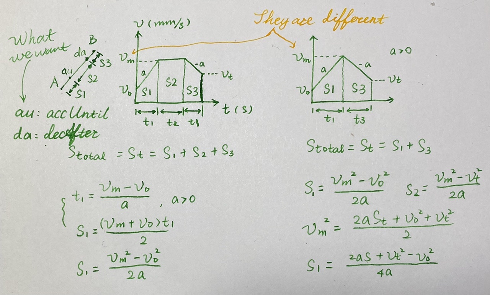
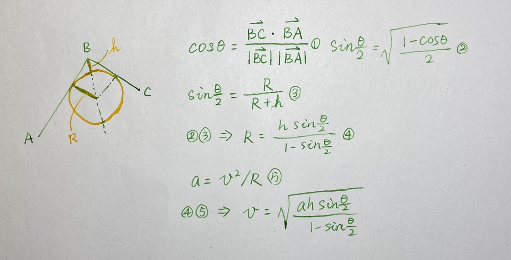

# 浅析3D打印机原理

大家好, 我是阿诺. 今天将通过实现一个3D打印机固件来理解3D打印机是如何工作的. [代码地址](https://github.com/arnosolo/simple_3d_printer) 

### 开发环境

#### 硬件准备

* 主控芯片
  
  * [AVR mega2560](https://ww1.microchip.com/downloads/en/devicedoc/atmel-2549-8-bit-avr-microcontroller-atmega640-1280-1281-2560-2561_datasheet.pdf)

* 主板
  
  * [MKS GENL V2.1](https://github.com/makerbase-mks/MKS-GEN_L/tree/master/hardware/MKS%20Gen_L%20V2.1_001) 

* 电机驱动
  
  * X TMC2008
  * Y TMC2008
  * Z A4988
  * E TMC2225

* 显示器
  
  * 暂未实现, 通过串口交互

* 机身
  
  * [大鱼i3](https://space.bilibili.com/488684813/channel/collectiondetail?sid=19843) 

    

#### 软件编写

1. 下载[vscode](https://code.visualstudio.com/)

2. 安装platformio插件

3. 打开platformio标签, 创建新项目, 开发板选择mega2560, 开发框架选择Arduino

4. 在`main.cpp`中输入测试代码
   
   ```cpp
   // src/main.cpp
   #include <Arduino.h>
   
   void setup() {
       Serial.begin(115200);
   }
   
   void loop() {
       Serial.println("Hello from Mega2560.");
       delay(1000);
   }
   ```

5. 将打印机主板连接到电脑, 点击`vscode`下方状态栏的➡, 上述代码会被自动编译并上传到打印机主板中
   
   

6. 打开串口助手, 连接主板, 如果发现主板不断返回`Hello from Mega2560.` 说明环境配置成功

### G代码解析

G代码由像[Cura](https://ultimaker.com/software/ultimaker-cura)或者[Prusa](https://www.prusa3d.com/page/prusaslicer_424/)这样的切片软件生成, 它将指导打印头如何运动,又该保持在什么温度上



- 最常见`G代码`
  
  ```gcode
  G1 F200 X2 Y4 ; 移动到(2,4,0) 速度为200mm/min, 99%的G代码都是G1
  G28 X0 Y0 ;move X/Y to min endstops
  M104 S200 ; 热端升温到200℃
  M20 ; 列出SD卡中的文件
  M23 ; 选择一个SD卡中的文件
  ```
  
    G代码详解: [marlin](https://marlinfw.org/docs/gcode/G000-G001.html) 

本节的要求是将 G1 X2.4 Y5.6 这样的字符串转换 `gcode对象`, 完成即可进入下一节.

- `gcode对象`示例
  
  ```c++
  gcode.cmdtype = 'G';
  gcode.cmdnum = 1;
  gcode.X = 2.4;
  gcode.Y = 5.6;
  gcode.hasX = true;
  gcode.hasY = true;
  ```

### SD卡

正常来说, 我们需要配置SPI以使用SD卡, 但是由于我们的开发框架是Arduino, 且我们的芯片是mega2560, 所以我们可以直接使用[Arduino SD库](https://github.com/arduino-libraries/SD). 我们唯一需要做的就是在主板原理图中找到SD卡的CS引脚(chip select), 并调用`SD.begin(csPin)`.

### 温度控制

本节要求是可以将`热端`温度控制在200℃

具体来说就是要创建一个`hotend`对象,它将拥有一下几个功能:

```c++
hotend.setTargetTemp(200); // 设定目标温度为200℃
hotend.readTemp(); // 读取当前温度
hotend.update(); // 以更新MOS管的开关时间
```

而后创建一个每200ms执行一次的中断服务函数, 每次中断执行一次`hotend.update()`. (定时器初始化放在`Heater::init`中)

其中Heater类的实现在`module/Heater.cpp`, 中断服务函数在`main.cpp`

这里主要需要讲的是PID控制器几个参数的含义(虽然它们名字听上去很复杂,但是其实只是简单的加减乘除):

- 控制器输出值
  
  - 一个0~255的数, 125表示加热器功率设为50%

- **E**rror
  
  - 当前温度150℃, 目标温度200℃, 则偏差值为50

- **P**roportion 比例
  
  ```cpp
  p = kp * err;
  ```
  
  - 假设当前温度150℃, 目标温度200℃, `kp`值为1.0, 则`p项`=50. 加热器功率设为(50/255)=20%
  - 有了这一项就能控制温度. 但是只有这一项, 可能加到170℃温度就加不上去了, 因为这时候加热器功率只有12%, 正好加热器向空气中散发的热量也是这个功率. 这种现象被称为*稳态误差*.

- **I**ntegration 积分
  
  ```cpp
  pidIntegral += err;
  i = ki * pidIntegral;
  ```
  
  * `i项`可以解决只有`p项`时出现的*稳态误差*. 假设`ki`为0.5, 那么当加到170℃温度就加不上去时, `pidIntegral`每200ms就会增加30, `i项`每200ms就会增加15, 加热器功率每200ms就会增加(15/255)=6%, 如此假以时日, 温度自然就上去了.

- **D**ifferentiation 微分
  
  ```cpp
  d = kd * (err - pidPrevErr);
  ```
  
  * 你可能会说, 按我这个说法, 那只要有`p项`和`i项`就能实现温度控制了. 确实如此, 如果你发现有了`p项`和`i项`就能很好的控制温度的话, 那完全可以把`ki`设成0. 但是如果我们想要防止温度变化过快的话, 那么可以试试加上`d项`. 因为假设目标温度为200℃, `kd`为1. 如果上一个周期温度为170℃, 这一个周期温度为190℃, 那么`d项`就是20. 而如果上一个周期温度为170℃, 这一个周期温度还是170℃, 那么`d项`就是0. 可以说`d项`这家伙就是**讨厌变化**. 这在到达目标温度后, 防止温度快速滑落很有用, 因为上文不是提到了嘛, `i项`需要"假以时日", `p项`则在快到目标温度时萎靡不振.

### 电机控制

这一节的要求能够控制步进电机正反转.

具体来说, 就是需要实现`motor`对象的以下方法

```c++
motor.enable();
motor.setDir(1); // 设定电机转动方向
motor.moveOneStep();
```

#### A4988

我们将使用`A4988`模块来控制步进电机, 下面给出`A4988`的原理图



1. VMOT
   
   接8v~35v直流电源,需要在`VMOT`和`GND`间布置一个100uf的电容,以快速响应电机的电能需求.

2. 1A 1B
   
   接第一个线圈

3. 2A 2B
   
   接第二个线圈

4. VDD
   
   接MCU电源

5. DIR
   
   方向控制引脚,接MCU输出,高低电平分别代表一个转动方向

6. STEP
   
   一个方波电机运动一次,如果设置步进细分为1,则运动一次一步进,一次步进为1.8°,200步可以转一圈

7. MS1 MS2 MS3
   
   对步进进行细分,至多可以将一步进细分为16次运动
   
   | MS1 | MS2 | MS3 | subdivision |
   | --- | --- | --- | ----------- |
   | 0   | 0   | 0   | 1           |
   | 1   | 0   | 0   | 2           |
   | 0   | 1   | 0   | 4           |
   | 1   | 1   | 0   | 8           |
   | 1   | 1   | 1   | 16          |

8. ENABLE
   
   接`低电平`模块开始`工作`, 接`高电平`则模块`关机`, `悬空`则模块`工作`.

9. SLEEP
   
   接低电平则电机断电,用手拧可以自由转动. 接高电平则电机工作.

10. RESET
    
    默认悬空. 收到低电平时,重置模块. 如果不打算控制这个引脚,则应该将其连接到SLEEP引脚以设置为高电平.

所以使用`A4988`控制电机一共有4步, 具体实现在`module/Stepper.cpp`

1. 接线. 前往注意**不要装反了**,装反了模块会**烧掉**.
2. 设置`enable`引脚为`低电平`以激活模块
3. 设置`dir`引脚以设置方向
4. 向`step`引脚发射脉冲以要求电机运动

#### 轴步数

现在我们知道了如何经由`A4988`控制电机, 但是电机转一步(step), 打印头到底走多少距离(mm)呢?

- 同步轮与皮带
  
  以2GT, 20齿的同步轮为例. 2GT的意思是走一个齿皮带运动2mm, 那么如果同步轮有20齿, 转一圈皮带走40mm. 而如果我们电机驱动采用16细分, 那么步进电机一圈就是3200步.
  
  ```
  轴步数 = 3200steps / 40mm = 80steps/mm
  ```
  
  所以如果我们使用i3的结构, 希望打印头在x轴正方向上前进10mm, 那么就需要MCU向`A4988`发射 3200 * 10 = 32000 个脉冲.

- 丝杆
  
  以螺距2mm, 导程8mm的丝杆为例. 导程的意思是丝杆转一圈所行走的直线距离. 所以
  
  ```
  轴步数 = 3200steps / 8mm = 400steps/mm
  ```
  
  所以如果我们使用i3的结构, 希望打印头在z轴正方向上前进10mm, 那么就需要MCU向`A4988`发射 3200 * 400 = 1,280,000 个脉冲

### 限位开关

打印机每次开机都需要寻找零点, 想要归零的话, 除了需要了解如何驱动电机外, 还需要了解限位开关的原理. 我们将需要实现以下方法

```cpp
xMin.isTriggered() // 开关被按下则返回true
```


限位开关有三个引脚分别是常开,常闭,公共端. 相应的就有了两种工作模式`常开`和`常闭`. 这里我们选择`常闭`. 于是通过读取MCU引脚电平高低即可实现判断, 具体实现在`module/Endstop.cpp`

| 限位开关状态 | 电路通断 | MCU引脚电平 |
| ------ | ---- | ------- |
| 未触发    | 通    | 低       |
| 触发     | 断    | 高       |

### 运动控制

这一节的目标是串口输入 G1 F1000 X6 Y3 热端将到达指定坐标点(6,3,0)

#### 如何使得轨迹看起来显示一条直线?

假设我们的起始点为(0,0) 那么走到(6, 3)就需要要求 X电机走(6 x 80)步, Y电机走(3 x 80)步. 我们当然可以要求X电机先走, Y电机后走, 也能到达目的地, 但是画出来的线与理想的线段可就有相当的差距了. 或者我们可以先画出理想线段, 然后在它的附近画线.


可是这该怎么实现呢? 这个问题前人已经想好了, 还给它起了个名字叫*Bresenham算法*. 具体来说就是既然X方向需要走480步, Y方向需要走240步, 那么就相当于总共要走480次, X方向每次前进一步, Y方向每2次前进一步. 这480次运动事件, 每一次被称为一个`step event`. 总的次数叫做`step event count`, 它的值就是X,Y中的较大值.

```cpp
// module/Planner.cpp - planBufferLine
block.stepEventCount = getMax(block.steps);

// main.cpp - motion control isr
motorX.deltaError = -(curBlock->stepEventCount / 2);
motorY.deltaError = motorX.deltaError;

motorX.deltaError += curBlock->steps.x;
if (motorX.deltaError > 0) {
    motorX.moveOneStep();
    motorX.deltaError -= curBlock->stepEventCount;
}

motorY.deltaError += curBlock->steps.y;
if (motorY.deltaError > 0) {
    motorY.moveOneStep();
    motorY.posInSteps += curBlock->dir.y;
    motorY.deltaError -= curBlock->stepEventCount;
}
```

注意实现:

​    不要使用**浮点数**来计算步数, 因为会导致失步



#### 多个运动指令

上文我们实现了如何执行一条G1指令. 那么多条指令该怎么办呢?

我们可以将一个包含了每个电机运动多少步, 向那个方向运动的对象放入一个`队列`(queue)中. 需要的时候再从队列中取出.

- block
  
  ```cpp
  block.dir.x = 1
  block.steps.x = 37
  ...
  block.stepEventCount = 37
  block.accelerateUntil = 6
  block.decelerateAfter = 37
  block.entryRate = 1808
  block.nominalRate = 2001
  block.exitRate = 2001
  ```

### 速度控制

使用定时器中断的时间来控制打印头前进的速度. 

比如我们希望速度是1000steps/s, 那么定时器就需要每1ms产生一次, 同时在中断服务函数中执行一次`步进事件`(step event).

如果我们需要改变速度, 则可以在中断服务函数中设定触发中断的计数器值. 不过我们现在可以暂时把它设置成匀速.

### 速度衔接

这一节的目标是计算两运动线段的衔接速度, 而后计算出每个运动线段何时加速何时减速.

其实做好上面的步骤, 把移动速度设置成匀速, 打印机就能用了. 但是我们还是能够通过适当的改变移动速度来使得打印机的打印速度有适当的提高.

#### 梯形加速

上文提到我们可以通过改变中断时间来改变速度. 那么就会涉及到一个问题: 何时加速, 何时减速?

具体来说就是将一个block分成加速段,匀速段以及减速段并计算它们的长度. 计算并不复杂, 已在下图给出, 需要注意的是如果当前block长度很短的话, 加速图形会由梯形变成三角形.



#### 衔接速度

为了不让每个block之间速度跟连贯. 我们需要计算每个block的进入速度和退出速度. 估算方法下文已给出, 需要注意的是图中的圆弧只是用来估算衔接速度的, 打印头实际的路径并不会经过这段圆弧.


